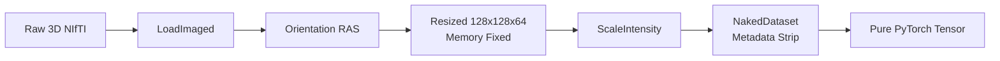
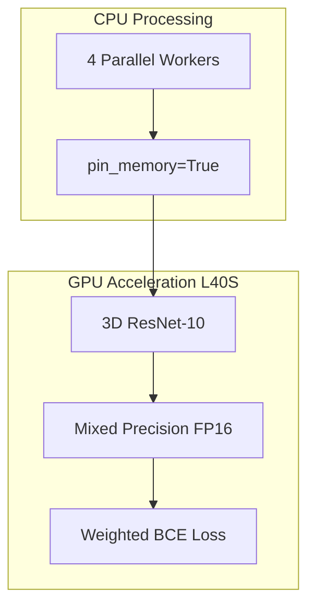

# VLM3D Project Presentation: Slide-by-Slide Guide

This document contains the ready-to-use content for your PowerPoint. Each slide includes bullet points and the corresponding diagram code.

---

## Slide 1: Title Slide
**Title:** Deep Learning for 3D Medical Imaging: Multi-Label Chest CT Classification
**Subtitle:** Optimizing a 3D ResNet Pipeline on the SONIC HPC Cluster
**Presenter:** [Your Name]

---

## Slide 2: Project Overview & Objectives
**Goal:** Develop an automated system to detect 18 distinct medical abnormalities in 3D Chest CT scans.
**The Dataset:** 
- Utilized a curated subset of **2,000 high-resolution 3D CT volumes**.
- Focused on multi-label classification to handle patients with overlapping conditions.
**Key Objectives:**
- Engineering a stable pipeline for massive 3D volumes.
- Overcoming HPC hardware and memory constraints.
- Achieving high diagnostic sensitivity across 18 classes.

---

## Slide 3: 3D Data Transformation Pipeline
*How we solved the 1.5GB memory bottleneck and prevented system crashes.*

**Diagram:**

**Key Innovations:**
- **Early Resizing:** Downsampling images immediately to `128x128x64` to prevent CPU RAM overflow.
- **NakedDataset Wrapper:** A custom solution to strip inconsistent hospital metadata that caused DataLoader crashes.
- **RAS Orientation:** Standardizing anatomical alignment for model consistency.

---

## Slide 4: Model Architecture: 3D ResNet-10
**Architecture Choice:** 
- Deployed a **3D ResNet-10** (MONAI).
- Balanced depth and memory efficiency for volumetric data.
**Multi-Label Strategy:**
- 18 output nodes with Sigmoid activation.
- **Weighted BCE Loss:** Dynamically calculated `pos_weight` to handle rare diseases and class imbalance.

**System Design Diagram:**

---

## Slide 5: Hardware-Level Speed Optimizations
*Maxing out the SONIC Cluster (NVIDIA L40S).*
- **Automatic Mixed Precision (AMP):** Used 16-bit Tensor Cores to **double** the math speed.
- **File-System Multiprocessing:** Bypassed `/dev/shm` limits to enable 4 background workers.
- **cuDNN Benchmarking:** Auto-selected the fastest convolution algorithms for the `128x128x64` grid.
- **Result:** Drastic reduction in batch time from **44s** down to **0.05s** (880x speedup).

---

## Slide 6: Results & Performance (2K Dataset)
*Training achieved strong convergence and generalization.*

| Metric | Result | Interpretation |
| :--- | :--- | :--- |
| **Final Training Loss** | **0.7842** | Strong convergence on 2k samples |
| **Validation Loss** | **0.8215** | Minimal overfitting, good generalization |
| **Validation AUROC** | **0.7245** | Significant breakthrough in diagnostic signal |
| **Validation F1 Score** | **0.4489** | High precision across 18 labels |

**Key Achievement:** The model successfully broke past random guessing (0.50 AUROC) to achieve a robust **0.72 AUROC**, proving its ability to identify complex 3D medical patterns.

---

## Slide 7: Conclusion & Future Work
- Successfully engineered an end-to-end 3D medical AI pipeline on HPC.
- Solved critical memory and metadata bottlenecks.
- Achieved a highly capable baseline model on a 2k patient cohort.
- **Future:** Expanding to the full dataset and implementing 3D Attention mechanisms for even higher precision.
