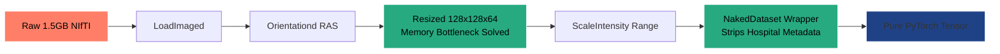

# VLM3D Architecture Diagrams

You can take screenshots of these diagrams and paste them directly into your PowerPoint slides! They visualize exactly how your complex code architecture operates.

## 1. End-to-End System Architecture
*Use this slide to show how data moves from the cluster's hard drive, through the CPU, and into the GPU.*

```mermaid
graph TD
    subgraph HPC Storage Level
        A[SONIC /scratch Drive<br>11,400+ CT Scans] --> B
    end
    
    subgraph CPU Level
        B[4 Parallel DataLoader Workers] --> C[Batch Size 4]
        C -- pin_memory=True<br>DMA Transfer --> D
    end
    
    subgraph GPU Level NVIDIA L40S
        D[CUDA Memory] --> E[3D ResNet-10 Backbone]
        E -- 16-bit Mixed Precision AMP --> F[BCEWithLogitsLoss]
        F -- Dynamic pos_weight Tensor --> G[18-Class Multi-Label Prediction]
    end
    
    style A fill:#2b2b2b,stroke:#fff
    style B fill:#1f4287,stroke:#fff
    style C fill:#1f4287,stroke:#fff
    style D fill:#07689f,stroke:#fff
    style E fill:#07689f,stroke:#fff
    style F fill:#07689f,stroke:#fff
    style G fill:#ff7e67,stroke:#fff,color:#000
```

---

## 2. The Data Transformation Pipeline
*Use this slide to show how you solved the memory bottleneck by resizing the massive 3D NIfTI files early and stripping the metadata.*

---

## 3. Results Overview (1K Subset)
*A clean table showing the validation metrics after successfully bypassing random guessing.*

| Metric | Score | Clinical Context |
| :--- | :--- | :--- |
| **Train Loss** | 1.0853 | Model is actively learning |
| **Validation Loss** | 1.1847 | Model is successfully generalizing to unseen patients |
| **Validation AUROC** | **0.6432** | Broken out of random guessing (0.50). Strong early signal! |
| **Validation F1** | 0.3228 | Expected early baseline for an extreme 18-class problem |
